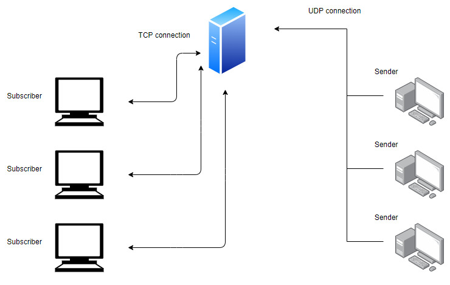

# Newspaper server-client application

Implemented
* asynchronous IO using the select syscall
* store and forward functionality

I used structures such as
* linked list
* subscriber object
* topic object

## Subscriber client

The subscriber client functions over the TCP protocol

Commands are received from console
List of valid commands :
* ID id tcp client send this message imediately after they connect
* SUBSCRIBE topic SF_FLAG
* UNSUBSCRIBE topic

## Sender client 

The sender client should functoins over the UDP protocol

It must send data about a topic in the following format :
``` topic|type|payload ```

It must use base64 to encrypt its messages

## Server

Lisnens for messages on the UDP and TCP ports

It can make all client stop



## Protocol

Client
	will automatically , and olny once send a message to tell it's ID
		if the ID is already in use it will receive and exit command
	will always close if gets an exit commnand
	won't send unvalid strings
		incomplete commands
		inexistent commnads
